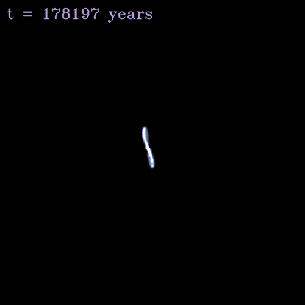

My senior thesis recently was announced as the runner-up for the Best Honors Thesis award for the computer science department! This was work conducted with Prof. Stella Offner, who studies star formation. Stella was my primary research for most of my undergraduate research career. I've learned a lot by working with her, and I can't thank her enough!

My thesis describes a new algorithm I developed for automatically tracking gas substructures in protostellar outflows. When a star is forming, it accretes gas from its environment; this accretion typically occurs on an equatorial disk (due to the conserved angular momentum of the system and dissipative forces within the gas). Due to magnetic effects, this accretion produces *outflows* which are uneven jets of gas that are ejected from the protostar's poles. These outflows are typically emitted in discrete *bullets*, which feed back into the stellar environment and have downstream feedback effects for the accretion processes. In particular, these feedback processes effect the final mass of the star, which in turn determines all other stellar properties of interest.

On the left is a video showing these polar outflows in a simulation of a protostellar region. On the right are the results of my algorithm, tracking these separate outflow structures through time and accounting for bullets merging.

My goal was to develop an algorithm that can automatically detect and quantify the bullets you see in the video. Unfortunately, unsupervised multi-target tracking algorithms do not exist. In addition, even the supervised trajectory-finding algorithms often use discrete optimization, which makes it difficult to apply the laws of physics. I developed a *continuous* optimization technique which enforces momentum conservation and mass conservation to automatically track these outflows. You can read more about it in my thesis [here](/src/assets/pdf/undergrad-thesis.pdf).