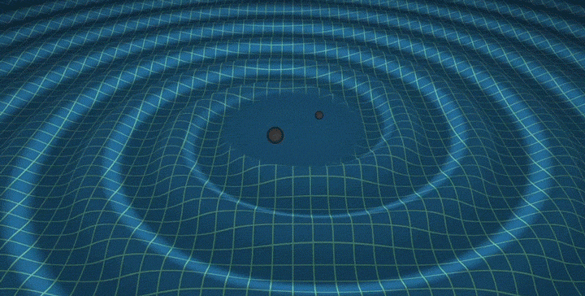

In this blog post, I’ll give back-of-the-envelope derivations for the power radiated by electric dipoles (Larmor radiation) and orbiting black holes (gravitational waves). We’ll also be able to see very plainly that the power emitted by a black hole binary right before it merges is independent of the black hole masses: black-hole mergers are standard sirens.

Let’s focus on the electromagnetic case first. The energy density of the field is something like $$\varepsilon\sim E^2/k$$ where $$k$$ is the Coulomb constant and $$E$$ is the electric field. (This comes from Poynting’s theorem.) I’ve dropped factors like $$4\pi$$ because they are annoying and I don’t care about them.

Charge is conserved. Let’s for a moment pretend it’s not. Like a syringe squeezing a big water droplet onto a penny, let’s imagine procuring a charge $$q$$ at some point in space over the course of some time interval $$\Delta t$$. Where there was once no electric field, there are now field lines emanating from the charge. Information about the procurement of the charge propagates outwards at light speed $$c$$, so the electric field lines fill a "bubble" of radius $$c\Delta t$$.  The average field strength in this bubble is something like $$E\sim kq/(c\Delta t)^2$$. The energy inside the bubble is then $$U\sim (E^2/k)(c\Delta t)^3=k q^2/(c\Delta t)$$ which checks out dimensionally.

Now let’s imagine slowly disappearing the charge and repeating this cycle over and over. We now have a characteristic timescale: the reciprocal of the oscillation frequency, $$\Delta t\sim \omega^{-1}$$. The power (energy per unit time) emitted by this electric monopole is then

$$
P_\mathrm{monopole}\sim k q^2c^{-1}\omega^2.
$$

But this is so silly. We can’t simply procure charge — charge is conserved. What we CAN do is mask a positive charge with a negative charge, to effectively make it disappear. By oscillating these two charges against each other, we get an oscillating dipole moment without violating charge conservation. Just as before, the energy of the radiation goes like the field strength squared. But now we have to keep track of the field produced by *both* charges, which interfere with each other. This interference makes the dipole field much weaker than the monopole field.  How much weaker? To calculate this interference correction, we’ll use a heuristic argument: far enough from the dipole, the radiation should look like the sum of two opposite monopole waves, displaced from each other by the dipole separation $$d$$. Here's an animation[^1] depicting this:

The spatial part of the superposed monopole waves goes like

$$
\begin{aligned}
e^{-i\omega x/c}-e^{-i\omega(x+d)/c}&=e^{-i\omega x/c}(1-e^{-i\omega d/c}) \\ &\approx e^{-i\omega x/c}(1-1+i\omega d/c)\\
&= i(\omega d/c) e^{-i\omega x/c}
\end{aligned}
$$

where I used the dispersion relation for light $$2\pi/\lambda=\omega/c$$. I also used a Taylor expansion since I’m assuming that $$d$$ is much smaller than the wavelength. The energy in a wave goes like the amplitude squared, which tells us that the power radiated by a dipole is damped by a factor of $$(\omega d/c)^2$$ compared to the power from the winking monopole, due to interference. This is the last ingredient we need to get the power radiated by an electric dipole:

$$
P_\mathrm{dipole}\sim (\omega d/c)^2 P_\mathrm{monopole} = k (qd)^2 \omega^4 c^{-3}
$$

Compare this to the exact answer given by Larmor’s formula:

$$
P_\mathrm{Larmor}=\frac{1}{3} k (qd)^2 \omega^4 c^{-3}
$$

Our stupid hacky derivation gets all the scaling right — we only miss the order-unity numerical factor.

Great news: we can apply the same analysis to gravitational waves, if we’re willing to make some extra logical jumps. The proportionality constant is now $$G$$ and the charges are now masses. The oscillation frequency is no longer a free parameter; it’s fixed by mechanics[^3] as $$\omega^2 = 2Gmd^{-3}$$. It turns out that the energy density in the gravitational field is analogous to that of the electric field, in that it goes like the squared field strength.[^4] The most important difference, though, is that not only is mass conserved (no monopole radiation), mass is also strictly non-negative. So, by symmetry, there can be no dipole moment. Gravitational radiation is in fact quadrupole radiation, which suffers an *extra* interference damping factor. So, modifying the same equation as before, the power in gravitational waves is 

$$
P_\mathrm{quad}\sim (\omega d/c)^4 Gm^2c^{-1}\omega^2 = G^4m^5 d^{-5}c^{-5}
$$

Compare with the true formula:

$$
P_\mathrm{grav} = \frac{64}{5}G^4m^5 d^{-5}c^{-5}
$$

Again we’re off by some numerical factor but the scaling is all correct.

The power emitted from a merging black hole binary is independent of the masses. This is because they coalesce roughly when their event horizons overlap, i.e., $$d\sim R_\text{Schwarzschild}=2Gm/c^2$$. Plugging this in, we get

$$
P_\text{merger} \sim c^5 G^{-1}
$$

which is a truly insane amount of power -- in the ballpark of $$10^{50}$$ Watts, more than the combined luminosity of all the stars in the universe. Since the power emitted depends only on universal constants, black hole mergers are "standard sirens" -- we can exploit the inverse-square law to determine the distance to the merger. Here’s a cool animation.[^2]

Much of this derivation was taught to me by Eugene Chiang, and I thought it was a really cool and easy way to re-derive some radiation formulas.

[^1]: [Inlay animation](https://www.en.didaktik.physik.uni-muenchen.de/multimedia/dipolstrahlung/animated-gifs-aus-bildern/index.html)
[^2]: [Gravitational wave animation](https://www.ligo.caltech.edu/video/ligo20160615v1)
[^3]: I’m assuming here that the masses are equal for simplicity; breaking this assumption just introduces numerical factors, which I already said I don’t care about.
[^4]: It’s probably because they’re both inverse-square laws, but I’m not sure tbh.
