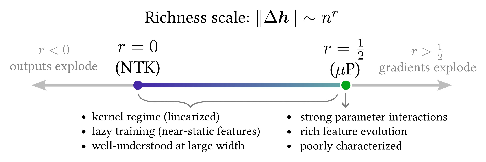
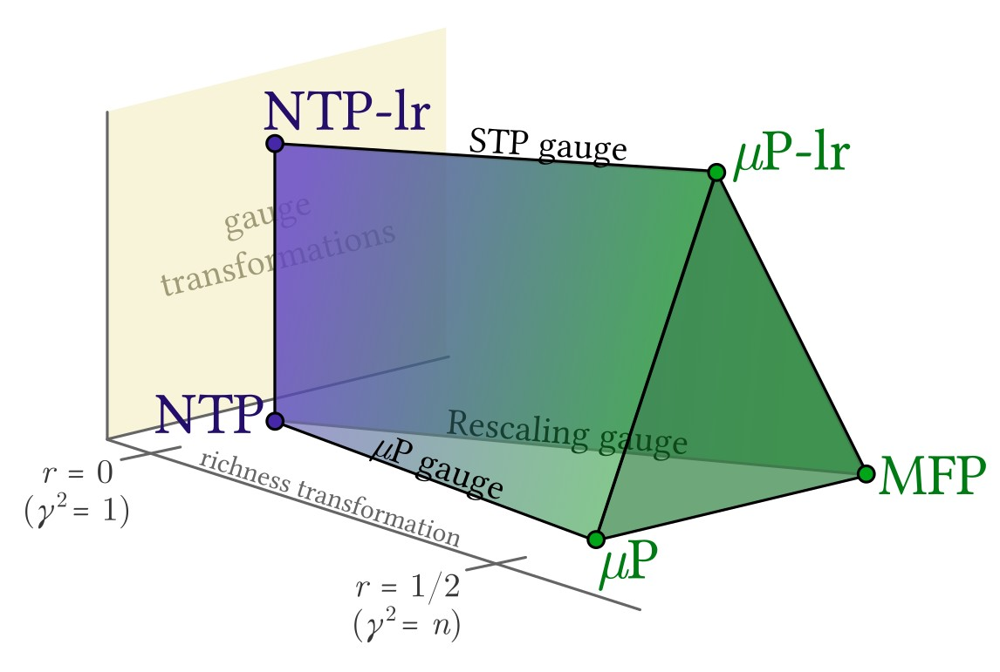
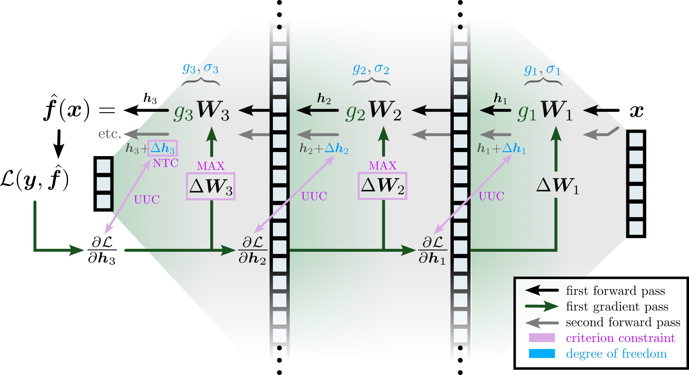

A central theme of the modern machine learning paradigm is that larger neural networks achieve better performance. One particularly useful kind of largeness is the network *width*, i.e., the dimension of the hidden representations. To understand the learning mechanisms in wide networks, we should aim to first understand the limiting behavior -- what happens at infinite width? But training infinitely wide networks isn't a walk in the park -- infinity is a bit of a trickster, and we should be cautious around him.

As it turns out, in order to train infinitely wide networks well, there's only *one* effective degree of freedom in choosing how to scale hyperparameters such as the learning rate and the size of the initial weights. This degree of freedom controls the *richness* of training behavior: at minimum, the wide network trains lazily like a kernel machine, and at maximum, it exhibits feature learning in the active $$\mu\mathrm{P}$$ regime. I recently wrote a [review paper](https://arxiv.org/abs/2404.19719) giving a straightforward derivation of this fact. This paper was a product of my own effort to navigate the literature on wide networks, which I personally found unclear. In this blog post, I'll just cover the main ideas.

## What's so tricky about infinite-width networks?

Feedforward (supervised) nets are relatively simple architectures: there's a forward pass, where predictive signal flows from input to output, and a backpropagating gradient, where error signal flows from output to input. Training models just consists of repeating this process a bunch of times with diverse data.[^1] These flows should neither blow up nor decay to zero over the course of the flow.

The problem of vanishing or exploding gradients should be familiar to students of deep learning -- it's exactly the issue that incapacitated recurrent neural networks. Fundamentally, this was a problem of coordinating signal propagation in the presence of infinity (in that case, infinite depth). We have an analogous problem on our hands. How might we choose our model hyperparameters to ensure that signal flows well in both directions?

## Formalizing the training desiderata

We need to be specific about exactly what we want. Let's use a concrete model: let's say, a simple MLP with some finite input and output dimension, and hidden dimensions which all go to infinity. We'll initialize each weight matrix i.i.d. Gaussian with some variance of our choosing. We'll choose the learning rate separately for each layer too. (This is not the standard way to train networks, but we'll need the extra hyperparameters.) What does it mean for signal to "flow well?"

0. The magnitudes of the elements of each hidden representation should be width-independent (i.e., order-unity).
1. After each SGD step, the change in the network outputs shouldn’t scale with the width. This ensures that the loss decreases at a width-independent rate.
2. After each SGD step, each representation should update in a way that contributes to optimizing the loss.
3. After each SGD step, a layer’s weight update should contribute non-negligibly to the following representation update. (I.e., a representation's update shouldn't be dominated by updates to the previous representation.)

That's it. These desiderata constrain *almost* all the free hyperparameters -- after the dust settles, there's exactly one degree of freedom remaining, which controls the size of the updates to the hidden representations. For this reason, this degree of freedom is intimately tied with the model's ability to learn features from the data.

Let's be specific now. Let's call this remaining degree of freedom the *activity*, $$\alpha \equiv \gamma n^r$$. I've already taken the liberty to factor the activity into a part that scales with the width $$n$$ (with scaling exponent $$r$$), and a prefactor $$\gamma$$ which doesn't.[^2] The signal propagation arguments in my review paper can only constrain the the scaling part, so I'll just set $$\gamma=1$$ hereforth.

Actually, we can't just choose any $$\alpha$$. We're actually restricted to choose within $$0 \leq r \leq 1/2$$. This interval is what I called the *richness scale*; choosing the richness $$r$$ constitutes a hyperparameter choice which determines whether the model learns rich features. After choosing $$r$$, set your hyperparameters according to:

and you can be sure that all our training criteria are satisfied. Specfically, choosing $$r=0$$ is called *neural tangent parameterization* (NTP), and your network will train lazily in the kernel regime, where dynamics are linear and the model converges to the kernel regression predictor. On the other hand, choosing $$r=1/2$$ is called *maximal update parameterization* ($$\mu\mathrm{P}$$), and your network will train actively in the rich regime, where the model learns features from the data.

At first blush, it seems incredible that you can satisfy all those desiderata *without* feature learning. How is it possible to train a network whose hidden representations evolve negligibly during training? This is one of infinity's greatest stunts -- in the infinite-width limit, lazy networks learn a task without ever adapting its hidden representations to the task! This is one of the major insights gained from studying the neural tangent kernel.

But of course, our job as scientists is to develop theory that describes practical networks. So, we should focus our energy on understanding the rich regime.

## Gauge symmetries and parameterizations galore

One last caveat -- the literature actually has a whole host of infinite-width parameterizations, most of which don't match the table above. For example, neither the [original NTK paper](https://arxiv.org/abs/1806.07572) nor the [$$\mu\mathrm{P}$$ paper](https://arxiv.org/abs/2011.14522) use layerwise learning rates. This seems to contradict the claim that there is only one degree of freedom in choosing hyperparameters. What's going on there?

The explanation is very straightforward -- these other papers introduce extra (redundant) hyperparameters. By redundant, I mean that varying these new hyperparameters does not result in any new training dynamics. Behaviorally, there is still only one degree of freedom (the training richness). The only difference is that there are now multiple ways to scale your hyperparameters to achieve any desired training richness.

This is exactly analogous to gauge symmetries in physics, where there are redundant degrees of freedom in a physical theory which have no experimentally observable consequences. I call the gauge in the table above "STP gauge." I call the gauge in the original NTK and $$\mu\mathrm{P}$$ papers "$$\mu\mathrm{P}$$ gauge." I call the gauge in [Bordelon and Pehlevan 2023](https://arxiv.org/abs/2205.09653) "rescaling gauge." These gauges (and their endpoint parameterizations) can be nicely visualized in parameterization space, where the different directions correspond to different ways of scaling your hyperparameters with width. Only one direction (the richness axis) affects training behavior; the other directions are either gauge transformations (yielding behaviorally-equivalent parameterizations) or violate the desiderata (not depicted).

See my [review paper](https://arxiv.org/abs/2404.19719) for more details!

[^1]: Contrast this with, e.g., Hopfield networks, which undergo a dynamical equilibration during inference. (Funnily enough, Hopfield nets just won the Nobel prize in physics.)

[^2]: This already contradicts the notation I use in my review paper (oops sorry). I did this because the review paper borrows the notation in [Bordelon and Pehlevan 2023](https://arxiv.org/abs/2205.09653), whereas here I'm using the more recent notation from [Atanasov et. al. 2024](https://arxiv.org/abs/2410.04642).