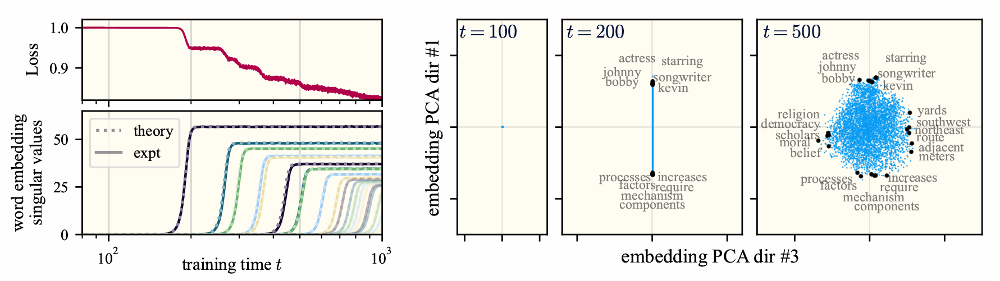

In my opinion, `word2vec` is such a cute lil guy. There's something so charming about his guileless simplicity. All he wants is to read some interesting text (say, all of Wikipedia) and learn some vectors, one for each word in the dictionary. And he does admirably well: by the end, each vector is laden with semantics. I want to know his secrets.

## tldr

Paper link: [Closed-Form Training Dynamics Reveal Learned Features and Linear Structure in Word2Vec-like Models.](https://arxiv.org/abs/2502.09863)

I (along with coauthors [Jamie Simon](https://james-simon.github.io/), [Yasaman Bahri](https://sites.google.com/view/yasamanbahri/home), and [Mike DeWeese](https://deweeselab.com/people/mike_deweese/index.html)) figured out *what* `word2vec` learns, and *how* it learns it. In essence, there are realistic regimes in which the learning problem reduces to unweighted least-squares matrix factorization. We solve the gradient flow dynamics in closed form; the final representations are simply given by PCA.

Here's a more detailed picture. Suppose we initialize all the embedding vectors randomly and very close to the origin, so that they're effectively zero-dimensional. Then (under some mild approximations) the embeddings collectively learn one "concept" (i.e., orthogonal linear subspace[^1]) at a time in a sequence of discrete learning steps. Since we intend for semantic relations between words to be represented in the angles between their embeddings, each new realized linear concept gives the word embeddings more space to better express themselves and their meanings.

(It's like when I dive head-first into learning a new branch of math. At first, all the jargon is muddled in my mind -- what's the difference between a function and a functional? What about a linear operator vs. a matrix? Slowly, through exposure to new settings of interest, the words separate from each other in my mind and their true meanings become clearer.)

Each of these linear concepts is just an eigenvector of a particular target matrix whose elements are determined solely by the corpus statistics and algorithmic hyperparameters. During learning, the model realizes these concepts as singular directions of the embedding matrix, each learned in a timescale determined by the spectrum of the target matrix. We derive this result under conditions that are very similar to those described in the original `word2vec` paper. In particular, *we don't make any distributional assumptions about the corpus statistics*. We empirically show that despite the slightly idealized setting, our theoretical result still provides a faithful description of OG `word2vec`.

In my completely biased opinion, this result is a banger. Closed form solutions in the distribution-agnostic setting are rare and hard to obtain; to my knowledge, this is the first one for a natural language task.

## Why study word2vec?

`word2vec` is one of the first machine learning algorithms I ever learned about -- and I'm sure that's true for many other young machine learning researchers. The core idea is pretty straightforward. Start by assigning random $d$-dimensional vectors to each word in your dictionary. Then, as you iterate through the corpus, align the vectors for words that show up together in context windows. At the same time, counterbalance this with a generic, global repulsion between all embeddings. (The way `word2vec` actually aligns and repels embedding vectors is by evaluating pairwise inner products as logits and minimizing a cross-entropy-style objective function.) After iterating through the corpus a couple of times, the word vectors that show up together frequently should have high cosine similarity, and unrelated words should have low cosine similarity. The [original algorithm](https://arxiv.org/abs/1310.4546) adds a lot of bells and whistles for increased computational throughput, but under the hood, the central idea is simply the contrastive algorithm I just described.

Given its simplicity, you might flinch when I call the resulting embedding weights a modern language model. But it is. It's a feedforward (linear) network, it's trained by gradient descent in a self-supervised fashion, and it learns statistical regularities in natural language by iterating through text corpora. Hopefully, then, you can agree that understanding `word2vec` amounts to understanding feature learning in a minimal yet interesting language modelling task.[^2]    

## The result

I want to know what `word2vec` learns as a function of training time. This requires understanding exactly how the optimization dynamics of the word embedding task induce an interaction between the corpus' token distribution and the linear model architecture. Tall order!

Before stating the result, I'll show a plot that illustrates what happens:

The key empirical observation is that `word2vec`, when trained from small initialization, learns in a sequence of essentially discrete steps. At each step, the rank of the $d$-dimensional embeddings increments, and the point cloud of embeddings expands along a new orthogonal direction in the ambient space of dimension $d$. Furthermore, by inspecting the words that most strongly align with these singular directions, we observe that each discrete piece of knowledge corresponds to an interpretable topic-level "concept." This is striking behavior. It suggests that there may exist regimes or limits under which the dynamics become exactly solvable.

This turns out to be precisely the case, under the following four approximations:
1. quartic approximation of the objective function around the origin
2. a particular constraint on the algorithmic hyperparameters (which is still close to the original `word2vec` implementation)
3. sufficiently small initial embeddings
4. vanishingly small GD step size.

Then, the training dynamics become analytically tractable. What's more, the resulting dynamics are pretttty close to those of unmodified `word2vec` above. See for yourself:

Note that none of the approximations involve the data distribution! Indeed, a huge strength of the theory is that it makes no distributional assumptions. As a result, the theory predicts exactly what features are learned in terms of the corpus statistics and the algorithmic hyperparameters. Neat!!

Ok, so what are the features? The answer is remarkably straightforward: the latent features are simply the top eigenvectors of the following matrix:

$$
\mathbf{M}^\star_{ij} = \frac{P(i,j) - P(i)P(j)}{\frac{1}{2}(P(i,j) + P(i)P(j))}
$$

where $i$ and $j$ index the words in the vocabulary, $P(i,j)$ is the co-occurrence probability for words $i$ and $j$, and $P(i)$ is the unigram probability for word $i$ (i.e., the marginal of $P(i,j)$). Constructing and diagonalizing this matrix from the Wikipedia statistics, one finds that the top eigenvector selects words associated with celebrity biographies, the second eigenvector selects words associated with government and municipal administration, the third is associated with geographical and cartographical descriptors, and so on.

The takeaway is this: during training, `word2vec` finds a sequence of optimal low-rank approximations of $\mathbf{M}^\star$. It's effectively equivalent to running PCA on $\mathbf{M}^\star$. Let me emphasize again that (afaik) no one had ever provided such a fine-grained picture of the learning dynamics of `word2vec`.

This is a really beautiful picture of learning. It almost feels too good to be true. So, a natural question is...

## Is it too good to be true?

Nah. Our result really captures what's going on.

You can get a sense just looking at the two plots above. The first two approximations essentially "untangle" the learning dynamics, making them analytically tractable. The core character of the learning remains. The final two assumptions are technical conveniences -- without them, I'd have to prove bounds on failure rates and approximation errors, and I don't know how to do that (nor do I want to).

Importantly, it's not just the singular value dynamics that agree -- the singular vectors (which is arguably where all the semantics reside) match too. As evident in the plots above, concepts 1 and 3 are pretty much the same between original `word2vec` and our model; this close correspondence between concepts persists as learning proceeds. Check out our paper to see more plots illustrating this comparison. 

As a coarse indicator of the agreement between our approximate setting and true `word2vec`, we can compare the empirical scores on the standard analogy completion benchmark: `word2vec` achieves 68% accuracy, our model (computed directly via SVD of $\mathbf{M}^\star$) achieves 66%, and the standard classical alternative (known as PPMI) only gets 51%.

## What do we learn about analogies?

To me, the most compelling reason to study feature learning in `word2vec` is because it is a toy model for the emergence of so-called *linear representations*: linear subspaces in embedding space that encode an interpretable concept such as gender, verb tense, or dialect. It is precisely these linear directions that enable the learned embeddings to complete analogies ("man : woman :: king : queen") via vector addition. Amazingly, [LLMs exhibit this behavior](https://arxiv.org/abs/2311.03658) as well, and the phenomenon has recently garnered a lot of attention, since it enables [semantic inspection of internal representations](https://arxiv.org/abs/2309.00941) and provides for [novel model steering techniques](https://arxiv.org/abs/2310.01405).

In `word2vec`, one typically uses vector differences to probe these abstract representations. For example, $\vec w_\mathrm{man}-\vec w_\mathrm{woman}$ is a proxy for the concept of (binary) gender. We empirically show that the model internally builds task vectors in a sequence of noisy learning steps, and that the geometry of these vector differences is quite well-described by the spiked covariance model.[^3] To me, this is rather suggestive -- it signals that random matrix theory might be a useful language for understanding how abstract concepts are learned. In particular, we find that overparameterization can sometimes decrease the SNR associated with these abstract concepts, degrading the model's ability to cleanly resolve them. See the paper for more details.

## Some final thoughts

Deep learning theory is really hard. To make progress, it's prudent to turn to simple models that we can analyze. Of course, there's an art to this -- the model shouldn't be so simple that it no longer captures the learning phenomena we care about.

I believe that we succeeded in isolating and analyzing such a model of `word2vec`. To me, the resulting picture is rather pretty -- `word2vec` essentially *does* reduce to PCA, so long as the quadratic approximation is made at initialization rather than at the global minimizer.[^4] This attests to the importance of accounting for the influence of underparameterization on the optimization dynamics; it is *not* sufficient to solve the unconstrained minimizer and then blindly enforce the rank constraint via least-squares.

It feels really apt that the (arguably) simplest self-supervised neural language model just reduces to the (arguably) simplest unsupervised algorithm. My feeling is that this hints at something deep and generic about learning dense representations via first-order self-supervised methods. Lots more work to be done!

[^1]: One can debate whether it's appropriate to call these "concepts." I argue that they really are the model's fundamental concepts -- each is an independent unit of knowledge, and the latent representations are uniquely and fully specified by their relation to these concepts. All the latent geometry is scaffolded by these abstractions. It's icing on the cake that these abstractions happen to be interpretable as topics and subject areas.

[^2]: To be clear, I use the word "understand" like a physicist: I'd like a quantitative and predictive theory describing `word2vec`'s learning process. No such theory previously existed.

[^3]: This is a random matrix ensemble in which a low-rank signal (called a "spike") is hidden in a thicket of Gaussian noise. If the signal-to-noise ratio is large enough, the spectrum of the random matrix (asymptotically) retains a footprint of the signal, in the form of an outlier eigenvalue. In our case, the signal is the abstract concept of interest. Characterizing the semantic "noise" is a great avenue for future work!

[^4]: Contrast this with embeddings constructed from the SVD of the PMI matrix. The PMI matrix is the [global unconstrained loss minimizer](https://papers.nips.cc/paper_files/paper/2014/hash/b78666971ceae55a8e87efb7cbfd9ad4-Abstract.html), but its least-squares embeddings are god-awful (and, importantly, they're different from the `word2vec` embeddings). This is the peril of ignoring the rank constraint til the end.