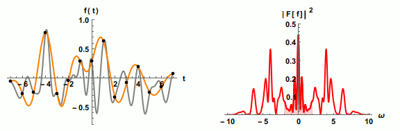

If you're an AV nerd, you're probably familiar with the number 44,100:

In middle school, I wanted to understand where this number came from, and I came across the [Nyquist-Shannon theorem](https://en.wikipedia.org/wiki/Nyquist%E2%80%93Shannon_sampling_theorem). Very roughly, I understood it to state that if you want to recover a frequency $f$ from discrete samples, your sampling rate has got to be at least $2f$. Human hearing goes up to 20 kHz, so the sampling rate needs to be at least 40 kHz. In 1979 Sony decided to go with 44.1 kHz to have a bit of practical headroom, setting the industry standard. I remember wishing I understood how it's possible to perfectly recover a continuous analog signal from only discrete samples -- isn't that an _infinite amount of compression_?? Unfortunately, the Wikipedia article was impenetrable to me at the time, so I decided I didn't need to know.

Recently I realized that this signal recovery problem is essentially a learning problem: we want to recover a continuous target from finite samples. The [eigenlearning framework](https://arxiv.org/abs/2110.03922), our theory of high-dimensional linear regression, should apply directly.

_**This is really interesting to me because it's a clear illustration of the duality between learning and compression.**_ In the linear case, the duality is well-understood; this blog post aims to make it explicit.

Fair warning: the technical parts of this blog post assume an understanding of linear algebra and some rough familiarity with the theory of linear regression.

## tl;dr

The Nyquist-Shannon theorem is just a special case of eigenlearning under a "passband" prior. If we know _a priori_ that the target function lies in a given $(2B+1)$-dimensional subspace of the full Hilbert space, then we can perfectly reconstruct it with only $n=2B+1$ samples using linear regression. Things get even nicer if the samples form a uniform lattice in the domain: then the data kernel becomes diagonal and we can solve the interpolator without expensive kernel inverses. This gives us the celebrated [Whittaker-Shannon interpolation formula](https://en.wikipedia.org/wiki/Whittaker%E2%80%93Shannon_interpolation_formula).

_Disclaimer:_ Throughout this post I focus on recovering periodic signals, because this problem is easy to understand. However, Nyquist-Shannon is generally about aperiodic signals. So all the results here are finite-period analogs of the general results: we get Dirichlet kernels instead of sinc kernels, we get a fixed number of samples instead of a finite sampling _rate_, yada yada. In principle, you can recover the general result by taking the period $T\to\infty$ and handling the associated mathematical intricacies, but I don't bother thinking about that because I think uncountable infinity is fake and bad. (...skill issue.) Anyways, if you're curious about this, you might find something useful in [this conversation](https://chatgpt.com/share/6897a189-698c-800c-a0f0-b55c87829b65).

## What the Nyquist-Shannon theorem says

Nyquist-Shannon concerns the following question: "When is it possible to fully reconstruct an unknown periodic signal from finitely many discrete samples?"

In general, you'd expect the answer to be "never" -- a continuous signal has infinitely many degrees of freedom, and $n$ samples can only constrain $n$ of them. However, the story changes if we know something extra about the target function up front. Nyquist-Shannon considers the following constraint: suppose the frequencies in the target signal $y^\star$ are all contained in a frequency band of bandwidth $B$. In this case is lossless discretization possible?

Yes, it is. Here's how.
1. Suppose $y^\star(t)$ is a periodic scalar signal with period $1$. If its Fourier series coefficients vanish outside a passband of width $B$ (excepting the constant DC mode $f=0$), then lossless discretization is possible if we take at least $n=2B+1$ samples of $y^\star$. (This is Nyquist's 1928 result.)
2. If these samples comprise a uniformly-spaced lattice in time, then we can reconstruct $y^\star(t)$ using the following formula. (This is Shannon's 1949 result, based partly on E. T. Whittaker's 1915 result.)
$$
y^\star(t) = \frac{1}{n}\sum_{i=1}^{n} y^\star(t_i) \cdot \frac{\sin(\pi n (t-t_i))}{\sin(\pi (t-t_i))}.
$$

Stay tuned -- we'll soon understand both these results in terms of kernel regression and our eigenlearning framework.

This [animation](https://commons.wikimedia.org/wiki/File:Nyquist_sampling.gif) illustrates the idea. Here, the sampling is always uniform but the number of samples is initially insufficient. As the number of samples increases, the recovered frequency band gets wider in the frequency domain (red), and the reconstruction (gold) improves. At the end, there are enough samples for perfect reconstruction.

## What eigenlearning says

Eigenlearning concerns the following question: "On average, how well can we reconstruct an unknown function from finitely many discrete samples using kernel ridge regression?"

Since kernel regression (KR) is just linear regression in a high-dimensional feature space, eigenlearning is really just about understanding the generalization behavior of linear regression. It describes[^1] estimators of the following form:
$$
\hat y(x) = K(x, \mathcal{X}) K^{-1}(\mathcal{X}, \mathcal{X}) y^\star(\mathcal{X})
$$
where $x$ is any test input, $\mathcal{X}$ contains the $n$ training inputs $\{x_j\}$, and $K(x, x')$ is a pre-specified kernel function. Then $K(x, \mathcal{X})$ and $y^\star(\mathcal{X})$ are $n$-dimensional vectors, and $K(\mathcal{X}, \mathcal{X})$ is an $n\times n$ matrix. For the linear kernel $K(x, x')= x^\top x'$, this reduces to ordinary linear regression.

Here is how I'd describe the core result of eigenlearning:
1. The kernel's eigendecomposition, $K(x,x')=\sum_i^{R} \lambda_i \phi_i(x)\phi_i(x')$, specifies an orthonormal set of basis functions, $\{\phi_i(x)\}$, and corresponding "spectral weights" $\{\lambda_i\}$.[^2] These are the core ingredients that describe how well the kernel learns.
    * Here, $R$ is the rank of the kernel. For common kernel functions like Gaussian RBF or Laplace, $R=\infty$. If $R$ is finite, then only the target functions that lie entirely within the span of the eigenbasis $\{\phi_i(x)\}$ are perfectly learned as $n\to\infty$.
2. It is useful to frame KR as "trying to reconstruct the components of the target function $y^\star(x)$ in the kernel eigenbasis." 
    * Concretely, the decomposition is $y^\star(x)=\sum_i v_i \phi_i(x) + \xi(x)$, where $v_i \equiv \langle \phi_i, y^\star \rangle$ are the target coefficients, and $\xi(x)$ is the part of $y^\star(x)$ orthogonal to $\{\phi_i(x)\}$ (unlearnable).
3. Given $n$ samples of the target function, KR more readily reconstructs the $v_i$ with the largest corresponding eigenvalues $\lambda_i$. As $n$ increases, KR begins to resolve eigencomponents with increasingly small $\lambda_i$.
    * In this sense, the eigenvalues specify a _spectral bias_ of the learning algorithm; they specify what _types of functions_ KR prefers to construct its estimators out of. Typically, these preferred functions enjoy some smoothness or low-degree-ness.
    * The average fraction of basis function $i$ actually recovered by KR is given by $\mathcal{L}_i\equiv\frac{\lambda_i}{\lambda_i + \kappa}$, where $\kappa$ satisfies $$ n = \sum_i^{R} \frac{\lambda_i}{\lambda_i + \kappa}$$ if $R>n$ (overparameterized), and $\kappa=0$ otherwise.

This paints a clear picture of average-case learning in linear regression: KR fits $n$ samples using (roughly) its top $n$ eigenfunctions.

## How eigenlearning yields Nyquist-Shannon

Comparing the first sentences of each of the preceding sections should be a strong hint that Nyquist-Shannon will fall out of eigenlearning.

In Nyquist-Shannon our function space consists only of functions with period $1$ (WLOG). The dimension of the space is countably infinite; the Fourier basis is natural. Now we further assume that the target function is bandlimited: it contains no more than $B$ distinct integer frequencies. Each frequency has a $\sin$ and $\cos$ component (or alternatively, an amplitude and a phase) which are independent. There may be a DC offset too (i.e., a constant mode) which has no phase. Therefore there are exactly $2B+1$ target coefficients we've gotta learn, and we can (in principle) constrain them all if we have at least $n=2B+1$ samples.

Ok, this heuristic argument is nice, but how do we actually reconstruct the signal? Well, let's just construct a kernel and run KR. To specify a kernel, we need to specify its eigenfunctions and corresponding eigenvalues. We know that the target function may have some DC component, and the rest is contained entirely within the $2B$-dimensional space of sinusoids within the given frequency band, so let's make these the top eigenfunctions. Let's set their eigenvalues to all be 1 (though it doesn't really matter what the eigenvalues are, as long as they're positive). This gives
$$
\begin{align*}
K(t, t') &= \sum_i^{R} \lambda_i \phi_i(t)\phi_i(t') = \sum_{f\in\{0, \pm\mathrm{band}\}} 1\cdot e^{2\pi i f t}\cdot e^{-2\pi i f t'}
\end{align*}
$$
where $\mathrm{band}$ is the set of positive integer frequencies in the passband. Then, according to eigenlearning:
* the rank of the kernel is $R=2B+1$
* $n\geq R$ so $\kappa=0$
* So therefore $\mathcal{L}_i = 1$, and the estimation variance is zero. (See [side quest 1](#side-quests).)

As a result, the target signal is almost _always_ perfectly reconstructed using KR -- we don't need uniformly-spaced samples! This guarantee is the first part of Nyquist-Shannon.

Unfortunately, KR is annoying because evaluating the estimator typically requires inverting a large kernel matrix. Can we get around this if we sample in a special way? The answer is yes; this is the second part of Nyquist-Shannon. We will show that the estimator becomes explicit and inverse-free if the samples are taken from a uniform lattice.

Proof by direct computation. Let's just evaluate the KR estimator $ \hat y(t) = K(t, \mathcal{T}) K^{-1}(\mathcal{T}, \mathcal{T}) y^\star(\mathcal{T}) $ with the kernel we just constructed. For simplicity, let's assume the frequencies are in the band $f\in [-B,B]$. (To show that we can make this assumption WLOG, see [side quest 2](#side-quests).) Then, using [a trig identity](https://en.wikipedia.org/wiki/Dirichlet_kernel#Proof_of_the_trigonometric_identity), we find that the kernel is the Dirichlet kernel:
$$
\begin{equation}
K(t, t') = \sum_{f=-B}^B e^{2\pi i f t}\cdot e^{-2\pi i f t'} = \frac{\sin( \pi(2B+1) (t - t'))}{\sin( \pi (t - t') )}.
\end{equation}
$$
The lattice $\mathcal{T}$ contains $2B+1$ points, so it's simple to evaluate the above and show that
$$
K(\mathcal{T}, \mathcal{T})_{ij} = (2B+1)\delta_{ij}.
$$
We've found that $K(\mathcal{T}, \mathcal{T})$ is proportional to the identity matrix! Inverting it has become a walk in the park. That's basically it. We just plug this into the KR estimator, finding
$$
\hat y(t) = K(t, \mathcal{T}) \left(\frac{1}{2B+1}\right) y^\star(\mathcal{T}) = \frac{1}{2B+1}\sum_{i=1}^{2B+1} y^\star(t_i) \cdot \frac{\sin(\pi (2B+1) (t-t_i))}{\sin(\pi (t-t_i))}
$$
where the $t_i$ are the lattice coordinates. We've just recovered the well-known Dirichlet interpolant from kernel regression. In the aperiodic limit $T\to\infty$, this turns into the Whittaker-Shannon interpolation formula.

## Concluding thoughts

Eigenlearning gives a theory of signal recovery from _random_ finite samples. At its most powerful, it tells us what happens when we have insufficient data for perfect reconstruction, what happens when the learner is genuinely mis-specified with respect to the target signal, and how ridge regularization alleviates these.

Nyquist-Shannon is a special case: the signal is known to be low-dimensional and perfectly recoverable with enough samples and zero regularization. In exchange for this simplicity, we demand more: we want to be able to reconstruct the target signal _efficiently_ (no kernel inverses permitted). To do this, we relinquish random sampling and instead use a regularly-spaced sampling lattice. This diagonalizes the regression estimator and exempts us from matrix inverse calculations. Neat trick, imo.

This learning/compression duality illustrates a fundamental tradeoff: the more we know a priori about the kinds of signals we want to learn, the fewer samples we'll need to get high-fidelity reconstruction. It's just no free lunch. For fixed kernels (as discussed in this post) the story is simple; for deep learning, where the kernels adapt to the data, the subtleties are only beginning to be understood.

## Side quests

1. In eigenlearning, the average reconstruction error is given by eigenlearning as

    $$
    \mathrm{mse} = \frac{n}{n-\sum_i^R \mathcal{L}_i^2} \left( \sum_i^R (1-\mathcal{L}_i)^2 v_i^2 + \xi^2 \right).
    $$

    Show that as $n\to R$, the average reconstruction error vanishes in the fully-specified setting (i.e., $y^\star(t)$ lies in the span of $\{\phi_i(t)\}$). This demonstrates that as long as the target signal is entirely contained within the kernel's RKHS, you will always be able to perfectly reconstruct the analog signal from any $n=R$ discrete samples (possibly excepting some measure-zero set of pathological samplings).
2. Using the convolution theorem, show that you can turn a passband signal (Fourier series has compact support in $\pm[f_0-B/2, f_0+B/2]$) into a baseband signal (Fourier series has compact support in $[-B, B]$) by pointwise multiplying the passband signal by $e^{-2 \pi i f_0 t}$. (Hint: convolving $y(x)$ with a dirac delta $\delta(x-x_0)$ is equivalent to a translating $y(x)$ by $x_0$.)
3. Using Eq. 1, show that the discrete Fourier transform of the Dirichlet kernel is a diagonal projection onto the low-frequency modes. (In this sense, the Dirichlet kernel is the time-domain representation of the low-pass filter on the unit circle.)

[^1]: Eigenlearning also concerns ridge regularization, but that's not necessary for this post, so I left it out.

[^2]: Both $\phi(\cdot)$ and $x$ may be vectors, but for simplicity let's only consider scalars everywhere.
