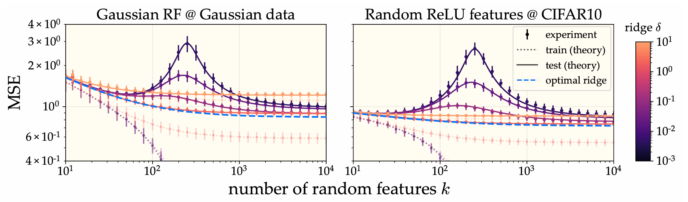

Here are some findings from the research I've worked on.

## Training dynamics of word2vec

[Paper link.](https://arxiv.org/abs/2502.09863)

What do contrastive word embedding models (e.g., word2vec) learn, and how? Specifically, what is learned by a model of size $$d$$ after training time $$t$$? By analytically solving for its learning dynamics, we find that
* it learns one topic-level concept at a time until its capacity (latent dimension $$d$$) is saturated
* each concept is represented as an orthogonal direction in latent space
* each of these orthogonal concepts is learned essentially independentally from the others
* these orthogonal semantic directions (and their learning trajectory) can be *explicitly computed in closed form* from the corpus statistics (!!!)
* linear representations of abstract semantic concepts (e.g., binary gender) are constructed in a series of learning stages that trade off signal and noise. This process is well-described by quantities from random matrix theory

In my completely biased opinion, this result is a banger. Closed form solutions in the distribution-free setting are rare and hard to obtain (in general, they're only known for some very idealized learning setups).

Btw, why care about word2vec? I'll give three reasons:
1. Theorists should build a repertoire of solved ML algorithms, even if they are relatively simple. (Think about the innumerable benefits studying the harmonic oscillator brought physics.)
2. It's a simple and relevant natural language task that requires feature learning! Understanding word2vec gives us a concrete new view into the general phenomenon.
3. LLMs exhibit behaviors directly analogous to word2vec. Perhaps most strikingly, LLMs often represent abstract semantic concepts as *linear subspaces* of the ambient latent space; this was famously first observed in word2vec, enabling word2vec embeddings to complete analogies such as *man : woman :: king : queen* via vector addition.

![We compare the time course of learning in our simplified model (top) and OG word2vec (bottom), finding striking similarities in their training dynamics and learned representations. Our analytical solution for the optimization dynamics reveals discrete learning steps corresponding to stepwise decreases in the loss (top left). In latent space (right side plots), embedding vectors expand into subspaces of increasing dimension at each learning step. These learned features can be extracted from our theory in closed form given only the corpus statistics and hyperparameters. We provide lots of evidence that our simplified model is a faithful proxy for word2vec.](../_images/research/qwem.png)

## More is better in modern ML

[Paper link.](https://arxiv.org/abs/2311.14646)

When are overparameterization and overfitting optimal? Both carry negative connotations classically -- many statistics textbooks warn against fitting very large models to relatively small datasets for fear of angering the overfitting demons and harming generalization. Out of spite, I trained a 25 million parameter ResNet on 50,000 images of CIFAR-10 and it generalized fine. What gives?

To answer this, we provide a theory of generalization in random feature (RF) models. RF regression can be thought of as a finite-feature approximation of kernel ridge regression (KRR), so Jamie's technique is to essentially take the existing eigenframework describing generalization in KRR, and then introduce (and average over) a second source of stochasticity arising from the finite feature sampling randomness. From the resulting equations, it's not hard to show that adding more features never hurts (so long as the ridge regularization is properly tuned). An immediate consequence of this is that infinite overparameterization (i.e., KRR) is optimal (from a generalization perspective). I did a bunch of experiments validing the theory.

So that takes care of the overparameterization question. What about regularization? Under what conditions is zero regularization (i.e., perfectly interpolating the training data) optimal? We give a necessary and sufficient condition in terms of the task difficulty (a.k.a. the *source condition*), the kernel spectral decay (a.k.a. the *capacity condition*), and the intrinsic noise level. I did several experiments showing that (convolutional) neural tangent kernels learning vision tasks (e.g., CIFAR-10, MNIST, SVHN) are in this regime in which interpolation is near-optimal.

## Lazy (NTK) vs active (muP) training

[Paper link.](https://arxiv.org/abs/2404.19719)

[Link to longer blog post.](/posts/ntk-mup-tutorial/)

Theoretical analyses of overparameterized models have recently focused on studying very wide neural networks. I wrote this tutorial to try to present a clean and conceptually illustrative derivation of the following fact: in order to train wide networks effectively, there is only one degree of freedom in choosing hyperparameters such as the learning rate and the size of the initial weights. This degree of freedom controls the *activity* or *richness* of training behavior: at minimum, the wide network trains lazily like a kernel machine, and at maximum, it exhibits feature learning in the $$\mu$$P regime.

The main argument goes like this. If we want training to go smoothly, the loss has to steadily decrease, each layer should feel the gradients equally, and each layer should contribute to the optimization. Quantifying these criteria mathematically provides constraints on the hyperparameters. Then I just solve the constraint problem. The result is the richness scale. As a nice serendipitous treat, the derivation (non-rigorously) recovers Greg Yang's [*dynamical dichotomy theorem*](https://arxiv.org/abs/2011.14522).

## Eigenlearning

[Paper link.](https://arxiv.org/abs/2110.03922)

[External link to longer blog post.](https://bair.berkeley.edu/blog/2021/10/25/eigenlearning/)

What is the generalization error of linear least-squares ridge regression? A shocking (to me) fact is that the answer to this question was not well-known until recently (2020 ish).

Wait, but in Machine Learning 101, don't we solve for the estimator in closed form? Yes, but this closed form solution is *conditional* on the training sample; for a given training sample, we can then compute the generalization error. But what about the average-case behavior? This requires averaging over the data distribution, which turns out to be pretty tricky due to high-dimensional shenanigans. Previous works accomplished this data average using either tools from random matrix theory or replica calculations. Jamie and Maddie figured out how to do it with a simpler trick reminiscent of the cavity method, and the resulting equations are conceptually cleaner and easier to interpret than previous work. I tagged along the tail end of this project, contributing an experiment in which I show that our eigenlearning framework can explain the deep bootstrap phenomenon discovered in [Nakkiran et al. 2020](https://arxiv.org/abs/2010.08127).